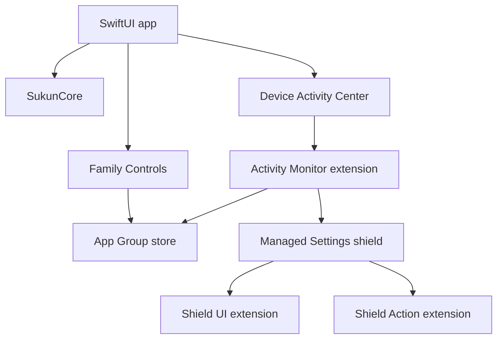

# المعمارية

## المكونات

## قواعد التصميم

- `SukunCore` لا يستورد أي إطار Apple خاص بـScreen Time؛ لذلك يمكن اختباره مستقلًا.
- التطبيق يحسب ويخطط ويحفظ، أما التنفيذ وقت إغلاق التطبيق فمسؤولية monitor extension.
- App Group هو قناة الحالة الوحيدة بين targets. لا توجد شبكة أو قاعدة بيانات.
- أسماء Device Activity تحتوي الصلاة ووقت البداية لتكون فريدة، مع حد 20 فترة دفاعي.
- الشروق يظهر في الواجهة لكنه لا يدخل `ProtectionPreferences.enabledPrayers`.

## مصادر الحقيقة

- المواقيت: `SolarPrayerCalculator`.
- نية المستخدم: `ProtectionPreferences` و`FamilyActivitySelection`.
- جاهزية النظام: `ProtectionHealth`.
- القيود الفعلية: `ManagedSettingsStore(named: .sukun)`.

## مخاطر معروفة

- مواقيت الجهات المحلية قد تتضمن تعديلات دقيقة؛ يجب إضافة offsets قابلة للضبط قبل التوسع العالمي.
- Device Activity callbacks مواردها محدودة؛ يجب إبقاء extension صغيرة ومن دون شبكة.
- Family Controls distribution entitlement يحتاج موافقة Apple لكل App ID ذي صلة.
